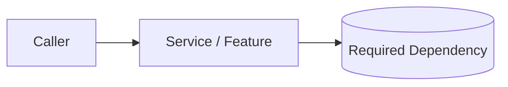

# Design Doc Template

Use this template for a service or material feature when a design document is justified. Remove sections that are genuinely not applicable and record important assumptions/open decisions instead of inventing infrastructure.

---

## [Service / Feature Name] — Design Doc

**Status:** Draft | In Review | Approved | Implemented  
**Authors:** [Names]  
**Date:** YYYY-MM-DD  
**Reviewers:** [Names / required review roles if defined]

### 1. Overview

What is being built or changed, why it is needed, and who/what consumes it?

### 2. Goals and Non-Goals

#### Goals

- [Measurable outcome]

#### Non-Goals

- [Explicitly excluded scope]

### 3. Requirements and Constraints

- Functional requirements: [links / summary]
- NFRs/SLOs that actually apply: [latency, availability, throughput, durability, privacy, etc.]
- Platform/stack constraints: [known choices]
- Compliance/security policies: [only established requirements]
- Unresolved material decisions: [questions]

### 4. High-Level Design

Show only components that actually exist in the proposed design. Include boundaries, important data flows, and external dependencies.

### 5. Detailed Design

#### 5.1 Interfaces / Contracts

| Interface | Direction | Request/Event | Response/Outcome | Compatibility Notes |
|---|---|---|---|---|
| | | | | |

#### 5.2 Data Model and Ownership

Describe owned state, relationships, transaction boundaries, consistency assumptions, retention, and migration needs that actually apply.

#### 5.3 Business / Processing Logic

Describe non-trivial rules, state transitions, concurrency/ordering/idempotency decisions, or algorithms.

#### 5.4 Dependencies and Boundaries

| Dependency / Capability | Why needed | Boundary / Integration | Failure behavior | Local-development approach if needed |
|---|---|---|---|---|
| | | | | |

Use shared capability interfaces such as `MessagePublisher`, `CacheProvider`, `ObjectStorageProvider`, `SecretProvider`, or `ConfigProvider` **only when the project adopts them or a real boundary is justified**.

### 6. Data, Security, and Compliance

| Data / Resource | Classification / Sensitivity | Protection / Access Requirement | Evidence / Policy Source |
|---|---|---|---|
| | | | |

Document only applicable authentication, authorization, secret-management, transport/storage protection, audit, retention, and disposal decisions. Do not preselect RBAC/ABAC, Vault, mTLS, field encryption, or a compliance framework without requirements.

### 7. Operability

Describe the evidence needed to operate the critical paths:

- logs/events;
- metrics/health signals;
- tracing/correlation when useful;
- alerts/SLOs/runbook/recovery;
- production dependency-failure behavior.

Do not require a specific observability product or every signal type when it adds no value.

### 8. Testing and Verification

| Risk / Behavior | Test or Check Level | Tool / Environment | Evidence Expected |
|---|---|---|---|
| | | | |

Choose unit, integration, contract/schema, end-to-end, load, security, or startup checks based on risk. Do not mandate mocks, Testcontainers, Pact, or staging for every design.

### 9. Delivery / Rollout / Migration

Document only strategies the change needs—for example feature control, compatibility migration, canary/phased rollout, data migration, rollback/recovery, or one-time operational steps.

### 10. Alternatives and Trade-offs

| Option | Benefits | Costs/Risks | Decision |
|---|---|---|---|
| | | | |

### 11. Open Questions

- [ ] [Question]

### 12. References

- Requirements / Plan: [link]
- [Architecture standard](../../standards/architecture.md)
- [Engineering principles](../../standards/engineering-principles.md)
- Related ADRs: `docs/decisions/ADR-NNN-<title>.md` when applicable

---

## Usage Instructions

1. Keep the document proportional to the change; do not fill sections with hypothetical mechanisms.
2. Resolve decisions that materially affect the approved implementation before the relevant PDD milestone.
3. Use the project's actual review/approval policy; this template does not impose an arbitrary reviewer count.
