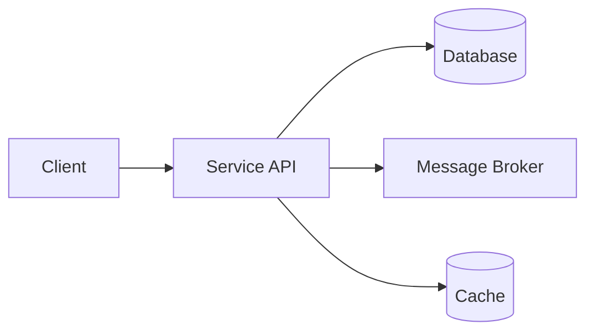

# Design Doc Template

High-level design doc template for new services. Copy this file and fill in all sections before starting implementation.

---

## [Service / Feature Name] — Design Doc

**Status:** Draft | In Review | Approved | Implemented

**Authors:** [Names]

**Date:** YYYY-MM-DD

**Reviewers:** [Names]

### 1. Overview

One paragraph describing what this service/feature does and why it exists.

### 2. Goals and Non-Goals

#### Goals

- [Goal 1: measurable outcome]
- [Goal 2: measurable outcome]

#### Non-Goals

- [Explicitly excluded scope]

### 3. Background

Context and prior art. Link to relevant ADRs, existing services, or business requirements.

### 4. High-Level Design

Include a diagram (Mermaid, ASCII, or image link) showing:

- Service boundaries and API surface
- Data flow between components
- External dependencies

### 5. Detailed Design

#### 5.1 API Design

| Method | Path | Request | Response | Description |
|--------|------|---------|----------|-------------|
| | | | | |

#### 5.2 Data Model

Describe entities, relationships, and storage strategy.

#### 5.3 Key Algorithms / Business Logic

Detail non-trivial logic, state machines, or processing pipelines.

#### 5.4 Infrastructure Dependencies

List capability interfaces used:

- [ ] MessagePublisher / MessageSubscriber
- [ ] CacheProvider
- [ ] ObjectStorageProvider
- [ ] SecretProvider
- [ ] ConfigProvider

### 6. Data Classification

| Data Element | Classification | Storage | Encryption |
|-------------|---------------|---------|------------|
| | PHI / PII / Internal / Public | | At-rest + in-transit |

### 7. Security Considerations

- Authentication: [mechanism]
- Authorization: [RBAC / ABAC / scope-based]
- Data encryption: [at-rest + in-transit strategy]
- Secrets management: [vault / env]

### 8. Observability

- **Metrics:** [key business + technical metrics]
- **Logs:** [structured logging with correlation IDs]
- **Traces:** [distributed tracing propagation]
- **Alerts:** [SLO-based alerting thresholds]

### 9. Testing Strategy

| Level | Scope | Tools |
|-------|-------|-------|
| Unit | Service + domain logic | JUnit/pytest + mocks |
| Integration | DB + external services | Testcontainers |
| Contract | API consumers | Pact |
| E2E | Full request flow | Staging environment |

### 10. Rollout Plan

- [ ] Feature flag name: `[flag-name]`
- [ ] Canary percentage: [X%]
- [ ] Rollback trigger: [metric threshold]
- [ ] DB migration strategy: [expand-then-contract]

### 11. Open Questions

- [ ] [Question 1]
- [ ] [Question 2]

### 12. References

- [Architecture](../../standards/architecture.md)
- [Engineering principles](../../standards/engineering-principles.md)
- Related ADRs: `docs/adr/ADR-NNN.md` *(create `docs/adr/` when the first ADR is recorded; add a link after the file exists)*

---

## Usage Instructions

1. Copy this template for each new service or major feature.
2. Sections 1-6 are **mandatory** before implementation begins.
3. Sections 7-10 must be complete before production deployment.
4. Submit as a PR for review. Minimum 2 approvals required.
